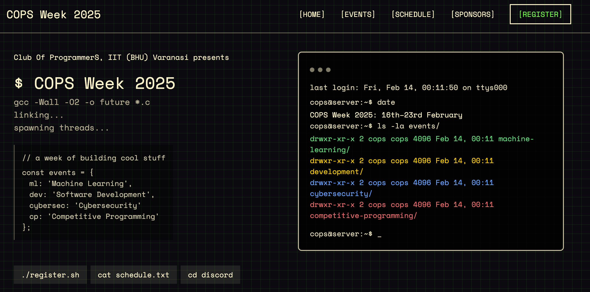

# COPS Week Website

This is the repository for the COPS Week website. The website is built using [Astro](https://astro.build/), and uses [TailwindCSS](https://tailwindcss.com/) for styling.

## 🧞 Commands

We make use of [Bun](https://bun.sh/) as the package manager for this project.

All commands are run from the root of the project, from a terminal:

| Command                   | Action                                           |
| :------------------------ | :----------------------------------------------- |
| `bun install`             | Installs dependencies                            |
| `bun run dev`             | Starts local dev server at `localhost:4321`      |
| `bun run build`           | Build your production site to `./dist/`          |
| `bun run preview`         | Preview your build locally, before deploying     |
| `bun run astro ...`       | Run CLI commands like `astro add`, `astro check` |
| `bun run astro -- --help` | Get help using the Astro CLI                     |
